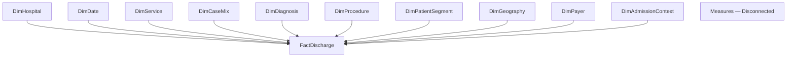

# Star Schema — Hospital Operations & Cost Efficiency

## Purpose

This document defines the approved logical star schema for the initial SPARCS hospital-operations semantic model.

## Fact Grain

`FactDischarge` contains one row per released inpatient discharge.

The source does not contain a reliable patient or durable discharge identifier. Discharge counts must not be interpreted as unique-patient counts.

## Logical Model

## Design Standards

| standard_id | decision | rationale |
| --- | --- | --- |
| FACT_GRAIN | FactDischarge contains one row per released inpatient discharge. | This matches the audited source grain. |
| NO_PATIENT_KEY | The model will not create or imply a unique-patient key. | The public file does not support patient-level linkage. |
| STAR_SCHEMA | Dimensions relate directly to FactDischarge. | This avoids snowflaking and ambiguous filtering. |
| SERVICE_GRAIN | DimService uses APR-DRG Code and APR MDC Code as a composite natural key. | Physical validation showed that APR-DRG Code alone does not uniquely determine APR MDC. The composite APR-DRG and APR MDC key resolves the observed one-to-many mapping while preserving both classifications. |
| HOSPITAL_GRAIN | DimHospital uses Permanent Facility Id as its natural key. Operating Certificate Number remains staging-only. | Physical validation identified a Permanent Facility Id with multiple non-null operating certificate numbers. PFI remains the facility-level identifier, while operating certificate number is not treated as a stable descriptive attribute. |
| RELATIONSHIP_DIRECTION | Relationships are active, one-to-many, and single-directional from dimension to fact. | This provides predictable Power BI filter behavior. |
| SURROGATE_KEYS | Whole-number surrogate keys are used for model relationships. | Integer keys support model compression and separate relationships from released business identifiers. |
| UNKNOWN_MEMBER | Surrogate key 0 is reserved for Unknown / Not Available. | Missing dimension values must not cause discharge rows to be dropped. |
| TIME_GRAIN | DimDate initially contains one row per available discharge year. | The audited source supports annual—not monthly—analysis. |
| PRIMARY_PAYER | The initial semantic model uses Payment Typology 1. | Secondary and tertiary payer fields would require role-playing or bridge-table design not required by the approved metrics. |
| PATIENT_GEOGRAPHY | DimGeography represents released patient ZIP3 geography. | Hospital county and service area remain attributes of DimHospital. |
| POST_OUTCOME_CONTEXT | Patient disposition may be used for descriptive slicing but not as an input to the primary expected-LOS or expected-cost benchmark. | Disposition may reflect events occurring during or after the hospitalization. |
| PREDICTION_OUTPUT_EXTENSION | Validated model predictions will be stored separately from descriptive peer-benchmark values and versioned during modeling. | Peer-expected LOS must not be confused with model-predicted LOS, and model version and scoring date must remain traceable. |
| BENCHMARK_COLUMNS | Peer-expected LOS and estimated-cost fields are planned in FactDischarge but remain deferred until benchmark computation. | Notebook 03 defines storage requirements without claiming that the benchmark has been calculated. |

## Table Specifications

| table_name | table_type | grain | primary_key | natural_key | business_role | important_caveat |
| --- | --- | --- | --- | --- | --- | --- |
| FactDischarge | Fact | One row per released inpatient discharge |  |  | Stores discharge-level foreign keys, LOS, financial amounts, validity flags, and later benchmark values. | No durable public discharge or patient identifier exists. |
| DimHospital | Dimension | One row per permanent facility identifier | hospital_key | permanent_facility_id | Hospital and released hospital geography. | Future multi-year loads must test whether hospital attributes change over time. |
| DimDate | Dimension | One row per available discharge year | date_key | discharge_year | Annual reporting context. | This does not support monthly trends. |
| DimService | Dimension | One row per APR-DRG code and APR MDC code combination | service_key | apr_drg_code\|apr_mdc_code | APR-DRG, MDC, and medical/surgical service classification. | APR-DRG Code alone does not uniquely determine APR MDC in the audited source. The validated composite natural key is APR-DRG Code plus APR MDC Code. |
| DimCaseMix | Dimension | One row per APR severity and mortality-risk combination | case_mix_key | apr_severity_code\|apr_mortality_risk | Released severity and mortality-risk classifications. | These classifications provide context but do not capture all case-complexity differences. |
| DimDiagnosis | Dimension | One row per released CCSR diagnosis code | diagnosis_key | ccsr_diagnosis_code | Released diagnosis classification. | The public classification is not a complete clinical history. |
| DimProcedure | Dimension | One row per released CCSR procedure code | procedure_key | ccsr_procedure_code | Released procedure classification. | Missing procedure categories remain represented. |
| DimPatientSegment | Dimension | One row per age-group, gender, race, and ethnicity combination | patient_segment_key | age_group\|gender\|race\|ethnicity | Released demographic segmentation. | This is a demographic segment—not a unique patient. |
| DimGeography | Dimension | One row per released patient ZIP3 value | geography_key | patient_zip3 | Coarse patient-residence geography. | ZIP3 does not identify an exact residence. |
| DimPayer | Dimension | One row per approved primary-payer group | payer_key | payer_group | Approved primary-payer classification. | The initial model excludes secondary and tertiary payer roles. |
| DimAdmissionContext | Dimension | One row per admission-type, disposition, and ED-indicator combination | admission_context_key | admission_type_group\|disposition_group\|ed_indicator_group | Admission-pathway and discharge-disposition context. | Patient disposition must not be treated as an admission-time predictor. |
| Measures | Measure table | One technical placeholder row |  |  | Dedicated location for governed DAX measures. | This table remains disconnected from the star schema. |

## Column Specifications

| table_name | column_name | data_type | column_role | source_fields | status |
| --- | --- | --- | --- | --- | --- |
| FactDischarge | hospital_key | Whole number | Foreign key | Permanent Facility Id | PLANNED |
| FactDischarge | date_key | Whole number | Foreign key | Discharge Year | PLANNED |
| FactDischarge | service_key | Whole number | Foreign key | APR DRG Code\|APR MDC Code | PLANNED |
| FactDischarge | case_mix_key | Whole number | Foreign key | APR Severity of Illness Code\|APR Risk of Mortality | PLANNED |
| FactDischarge | diagnosis_key | Whole number | Foreign key | CCSR Diagnosis Code | PLANNED |
| FactDischarge | procedure_key | Whole number | Foreign key | CCSR Procedure Code | PLANNED |
| FactDischarge | patient_segment_key | Whole number | Foreign key | Age Group\|Gender\|Race\|Ethnicity | PLANNED |
| FactDischarge | geography_key | Whole number | Foreign key | Zip Code - 3 digits | PLANNED |
| FactDischarge | payer_key | Whole number | Foreign key | Payment Typology 1 | PLANNED |
| FactDischarge | admission_context_key | Whole number | Foreign key | Type of Admission\|Patient Disposition\|Emergency Department Indicator | PLANNED |
| FactDischarge | source_record_key | Whole number | Technical row key |  | PLANNED |
| FactDischarge | los_days_lower_bound | Whole number | Additive value | Length of Stay | PLANNED |
| FactDischarge | is_top_coded_los | Whole number | Validity flag | Length of Stay | PLANNED |
| FactDischarge | is_valid_los | Whole number | Validity flag | Length of Stay | PLANNED |
| FactDischarge | total_charges | Fixed decimal number | Additive value | Total Charges | PLANNED |
| FactDischarge | is_valid_charge | Whole number | Validity flag | Total Charges | PLANNED |
| FactDischarge | total_costs | Fixed decimal number | Additive value | Total Costs | PLANNED |
| FactDischarge | is_valid_cost | Whole number | Validity flag | Total Costs | PLANNED |
| FactDischarge | is_paired_financial_valid | Whole number | Validity flag | Total Charges\|Total Costs | PLANNED |
| FactDischarge | peer_expected_los_days | Decimal number | Additive benchmark value | Permanent Facility Id\|APR DRG Code\|APR Severity of Illness Code\|Length of Stay | DEFERRED_BENCHMARK_BUILD |
| FactDischarge | los_peer_comparison_n | Whole number | Benchmark diagnostic | Permanent Facility Id\|APR DRG Code\|APR Severity of Illness Code\|Length of Stay | DEFERRED_BENCHMARK_BUILD |
| FactDischarge | peer_expected_estimated_cost | Fixed decimal number | Additive benchmark value | Permanent Facility Id\|APR DRG Code\|APR Severity of Illness Code\|Total Costs | DEFERRED_BENCHMARK_BUILD |
| FactDischarge | los_peer_benchmark_level | Text | Benchmark diagnostic | Permanent Facility Id\|APR DRG Code\|APR Severity of Illness Code\|Length of Stay | DEFERRED_BENCHMARK_BUILD |
| FactDischarge | cost_peer_comparison_n | Whole number | Benchmark diagnostic | Permanent Facility Id\|APR DRG Code\|APR Severity of Illness Code\|Total Costs | DEFERRED_BENCHMARK_BUILD |
| FactDischarge | cost_peer_benchmark_level | Text | Benchmark diagnostic | Permanent Facility Id\|APR DRG Code\|APR Severity of Illness Code\|Total Costs | DEFERRED_BENCHMARK_BUILD |
| DimHospital | hospital_key | Whole number | Primary key | Permanent Facility Id | PLANNED |
| DimHospital | permanent_facility_id | Text | Natural key | Permanent Facility Id | PLANNED |
| DimHospital | facility_name | Text | Attribute | Facility Name | PLANNED |
| DimHospital | hospital_service_area | Text | Attribute | Hospital Service Area | PLANNED |
| DimHospital | hospital_county | Text | Attribute | Hospital County | PLANNED |
| DimDate | date_key | Whole number | Primary key | Discharge Year | PLANNED |
| DimDate | discharge_year | Whole number | Natural key | Discharge Year | PLANNED |
| DimDate | year_label | Text | Attribute | Discharge Year | PLANNED |
| DimService | service_key | Whole number | Primary key | APR DRG Code\|APR MDC Code | PLANNED |
| DimService | apr_drg_code | Text | Natural key component | APR DRG Code | PLANNED |
| DimService | apr_drg_description | Text | Attribute | APR DRG Description | PLANNED |
| DimService | apr_mdc_code | Text | Natural key component | APR MDC Code | PLANNED |
| DimService | apr_mdc_description | Text | Attribute | APR MDC Description | PLANNED |
| DimService | medical_surgical_classification | Text | Attribute | APR Medical Surgical Description | PLANNED |
| DimCaseMix | case_mix_key | Whole number | Primary key | APR Severity of Illness Code\|APR Risk of Mortality | PLANNED |
| DimCaseMix | apr_severity_code | Whole number | Natural-key component | APR Severity of Illness Code | PLANNED |
| DimCaseMix | apr_severity_description | Text | Attribute | APR Severity of Illness Description | PLANNED |
| DimCaseMix | apr_mortality_risk | Text | Natural-key component | APR Risk of Mortality | PLANNED |
| DimDiagnosis | diagnosis_key | Whole number | Primary key | CCSR Diagnosis Code | PLANNED |
| DimDiagnosis | ccsr_diagnosis_code | Text | Natural key | CCSR Diagnosis Code | PLANNED |
| DimDiagnosis | ccsr_diagnosis_description | Text | Attribute | CCSR Diagnosis Description | PLANNED |
| DimProcedure | procedure_key | Whole number | Primary key | CCSR Procedure Code | PLANNED |
| DimProcedure | ccsr_procedure_code | Text | Natural key | CCSR Procedure Code | PLANNED |
| DimProcedure | ccsr_procedure_description | Text | Attribute | CCSR Procedure Description | PLANNED |
| DimPatientSegment | patient_segment_key | Whole number | Primary key | Age Group\|Gender\|Race\|Ethnicity | PLANNED |
| DimPatientSegment | age_group | Text | Natural-key component | Age Group | PLANNED |
| DimPatientSegment | gender | Text | Natural-key component | Gender | PLANNED |
| DimPatientSegment | race | Text | Natural-key component | Race | PLANNED |
| DimPatientSegment | ethnicity | Text | Natural-key component | Ethnicity | PLANNED |
| DimGeography | geography_key | Whole number | Primary key | Zip Code - 3 digits | PLANNED |
| DimGeography | patient_zip3 | Text | Natural key | Zip Code - 3 digits | PLANNED |
| DimPayer | payer_key | Whole number | Primary key | Payment Typology 1 | PLANNED |
| DimPayer | payer_group | Text | Natural key | Payment Typology 1 | PLANNED |
| DimAdmissionContext | admission_context_key | Whole number | Primary key | Type of Admission\|Patient Disposition\|Emergency Department Indicator | PLANNED |
| DimAdmissionContext | admission_type_group | Text | Natural-key component | Type of Admission | PLANNED |
| DimAdmissionContext | disposition_group | Text | Natural-key component | Patient Disposition | PLANNED |
| DimAdmissionContext | ed_indicator_group | Text | Natural-key component | Emergency Department Indicator | PLANNED |
| Measures | _measure_table_marker | Whole number | Technical placeholder |  | SESSION_6 |

## Relationships

| from_table | from_column | to_table | to_column | cardinality | cross_filter_direction |
| --- | --- | --- | --- | --- | --- |
| DimHospital | hospital_key | FactDischarge | hospital_key | One-to-many (1:*) | Single |
| DimDate | date_key | FactDischarge | date_key | One-to-many (1:*) | Single |
| DimService | service_key | FactDischarge | service_key | One-to-many (1:*) | Single |
| DimCaseMix | case_mix_key | FactDischarge | case_mix_key | One-to-many (1:*) | Single |
| DimDiagnosis | diagnosis_key | FactDischarge | diagnosis_key | One-to-many (1:*) | Single |
| DimProcedure | procedure_key | FactDischarge | procedure_key | One-to-many (1:*) | Single |
| DimPatientSegment | patient_segment_key | FactDischarge | patient_segment_key | One-to-many (1:*) | Single |
| DimGeography | geography_key | FactDischarge | geography_key | One-to-many (1:*) | Single |
| DimPayer | payer_key | FactDischarge | payer_key | One-to-many (1:*) | Single |
| DimAdmissionContext | admission_context_key | FactDischarge | admission_context_key | One-to-many (1:*) | Single |

## Source-to-Model Mapping

| source_field | target_table | target_column | semantic_action | transformation_requirement |
| --- | --- | --- | --- | --- |
| Hospital Service Area | DimHospital | hospital_service_area | INCLUDE | Trim text and map nulls to Unknown. |
| Hospital County | DimHospital | hospital_county | INCLUDE | Trim text and map nulls to Unknown. |
| Operating Certificate Number | Staging |  | STAGING_ONLY | Retained for source validation and lineage only. Not promoted to DimHospital because one Permanent Facility Id may have multiple operating certificate numbers in the audited source. |
| Permanent Facility Id | DimHospital | permanent_facility_id | INCLUDE | Retain natural identifier and derive hospital_key. |
| Facility Name | DimHospital | facility_name | INCLUDE | Trim text; do not use as the hospital key. |
| Age Group | DimPatientSegment | age_group | INCLUDE | Apply the approved category mapping. |
| Zip Code - 3 digits | DimGeography | patient_zip3 | INCLUDE | Retain as text and preserve masked/unknown values. |
| Gender | DimPatientSegment | gender | INCLUDE | Trim and preserve released categories. |
| Race | DimPatientSegment | race | INCLUDE | Trim and preserve released categories. |
| Ethnicity | DimPatientSegment | ethnicity | INCLUDE | Trim and preserve released categories. |
| Length of Stay | FactDischarge | los_days_lower_bound | INCLUDE | Parse valid values; represent 120+ as 120 and create flags. |
| Type of Admission | DimAdmissionContext | admission_type_group | INCLUDE | Apply the approved category mapping. |
| Patient Disposition | DimAdmissionContext | disposition_group | INCLUDE | Apply approved mapping; descriptive use only. |
| Discharge Year | DimDate | discharge_year | INCLUDE | Convert to whole number and derive date_key. |
| CCSR Diagnosis Code | DimDiagnosis | ccsr_diagnosis_code | INCLUDE | Retain as text and derive diagnosis_key. |
| CCSR Diagnosis Description | DimDiagnosis | ccsr_diagnosis_description | INCLUDE | Trim text. |
| CCSR Procedure Code | DimProcedure | ccsr_procedure_code | INCLUDE | Retain as text and derive procedure_key. |
| CCSR Procedure Description | DimProcedure | ccsr_procedure_description | INCLUDE | Trim text. |
| APR DRG Code | DimService | apr_drg_code | INCLUDE | Retain as text and combine with APR MDC Code to derive service_key. |
| APR DRG Description | DimService | apr_drg_description | INCLUDE | Trim text. |
| APR MDC Code | DimService | apr_mdc_code | INCLUDE | Retain as text and combine with APR DRG Code to derive service_key. |
| APR MDC Description | DimService | apr_mdc_description | INCLUDE | Trim text. |
| APR Severity of Illness Code | DimCaseMix | apr_severity_code | INCLUDE | Parse as a whole number from 1 through 4, validate against the severity description, and derive case_mix_key. |
| APR Severity of Illness Description | DimCaseMix | apr_severity_description | INCLUDE | Apply the approved category mapping. |
| APR Risk of Mortality | DimCaseMix | apr_mortality_risk | INCLUDE | Apply the approved category mapping. |
| APR Medical Surgical Description | DimService | medical_surgical_classification | INCLUDE | Trim and preserve released categories. |
| Payment Typology 1 | DimPayer | payer_group | INCLUDE | Apply the approved primary-payer mapping. |
| Payment Typology 2 |  |  | STAGING_ONLY | Retain in staging; secondary-payer modeling requires a separate role-playing or bridge-table design. |
| Payment Typology 3 |  |  | STAGING_ONLY | Retain in staging; tertiary-payer modeling requires a separate role-playing or bridge-table design. |
| Birth Weight |  |  | STAGING_ONLY | Retain in staging until a validated newborn-specific metric or segment is approved. |
| Emergency Department Indicator | DimAdmissionContext | ed_indicator_group | INCLUDE | Apply the approved category mapping. |
| Total Charges | FactDischarge | total_charges | INCLUDE | Parse numeric positive values and create validity flag. |
| Total Costs | FactDischarge | total_costs | INCLUDE | Parse numeric positive values and create validity flag. |

## Metric Support

| metric_id | metric_name | source_fields_supported | implementation_status |
| --- | --- | --- | --- |
| discharge_count | Discharges | True | DESIGN_SUPPORTED |
| facility_count | Facilities | True | DESIGN_SUPPORTED |
| total_los_days_lower_bound | Total LOS Days — Lower Bound | True | DESIGN_SUPPORTED |
| average_los_lower_bound | Average LOS — Lower Bound | True | DESIGN_SUPPORTED |
| median_los_lower_bound | Median LOS | True | DESIGN_SUPPORTED |
| los_interquartile_range | LOS Interquartile Range | True | DESIGN_SUPPORTED |
| p95_los_lower_bound | P95 LOS | True | DESIGN_SUPPORTED |
| top_coded_los_count | Top-Coded LOS Discharges | True | DESIGN_SUPPORTED |
| top_coded_los_rate | Top-Coded LOS Rate | True | DESIGN_SUPPORTED |
| extended_stay_rate | Extended-Stay Rate | True | PENDING_THRESHOLD |
| total_charges | Total Charges | True | DESIGN_SUPPORTED |
| average_charge_per_discharge | Average Charge per Discharge | True | DESIGN_SUPPORTED |
| median_charge_per_discharge | Median Charge per Discharge | True | DESIGN_SUPPORTED |
| total_estimated_costs | Total Estimated Costs | True | DESIGN_SUPPORTED |
| average_estimated_cost_per_discharge | Average Estimated Cost per Discharge | True | DESIGN_SUPPORTED |
| median_estimated_cost_per_discharge | Median Estimated Cost per Discharge | True | DESIGN_SUPPORTED |
| charge_to_cost_ratio | Charge-to-Cost Ratio | True | DESIGN_SUPPORTED |
| estimated_cost_per_inpatient_day | Estimated Cost per Inpatient Day | True | DESIGN_SUPPORTED |
| ed_origin_discharge_rate | ED-Origin Discharge Rate | True | DESIGN_SUPPORTED |
| emergency_admission_rate | Emergency Admission Rate | True | DESIGN_SUPPORTED |
| major_extreme_severity_rate | Major or Extreme Severity Rate | True | DESIGN_SUPPORTED |
| major_extreme_mortality_risk_rate | Major or Extreme Mortality-Risk Rate | True | DESIGN_SUPPORTED |
| home_discharge_rate | Home Discharge Rate | True | DESIGN_SUPPORTED |
| in_hospital_mortality_rate | In-Hospital Mortality Rate | True | DESIGN_SUPPORTED |
| average_apr_severity_index | Average APR Severity Index | True | DESIGN_SUPPORTED |
| disposition_share | Disposition Share | True | DESIGN_SUPPORTED |
| peer_expected_los_days | Peer-Expected LOS Days | True | DESIGN_SUPPORTED_CALCULATION_DEFERRED |
| los_actual_to_peer_expected_ratio | LOS Actual-to-Peer-Expected Ratio | True | DESIGN_SUPPORTED_CALCULATION_DEFERRED |
| excess_los_days_lower_bound | Excess LOS Days — Lower Bound | True | DESIGN_SUPPORTED_CALCULATION_DEFERRED |
| peer_expected_estimated_cost | Peer-Expected Estimated Cost | True | DESIGN_SUPPORTED_CALCULATION_DEFERRED |
| estimated_cost_actual_to_peer_expected_ratio | Estimated Cost Actual-to-Peer-Expected Ratio | True | DESIGN_SUPPORTED_CALCULATION_DEFERRED |
| excess_estimated_cost | Excess Estimated Cost | True | DESIGN_SUPPORTED_CALCULATION_DEFERRED |

## Key Policy

| policy_id | policy | implementation_stage |
| --- | --- | --- |
| INTEGER_SURROGATE_KEYS | All dimension relationships use whole-number surrogate keys. | Session 5 |
| UNKNOWN_KEY_ZERO | Key 0 represents an unresolved, missing, suppressed, or unavailable dimension member. | Session 5 |
| PRESERVE_FACT_ROWS | Missing dimension values map to key 0 rather than removing the discharge. | Session 5 |
| NATURAL_KEYS_VISIBLE | Released business identifiers remain available as descriptive dimension attributes. | Session 5 |
| TECHNICAL_KEYS_HIDDEN | Surrogate and foreign keys are hidden from report users. | Session 6 |
| NO_FACT_IDENTIFIER | The model does not invent a durable patient or discharge identifier. | Current design |
| ANNUAL_DATE_KEY | The initial date key represents discharge year only. | Session 5 |
| FUTURE_MULTIYEAR_REVIEW | Before appending additional years, test dimension attribute stability and key reuse across years. | Future multi-year build |

## Validation Results

| validation_test | passed | details |
| --- | --- | --- |
| Table names are unique | True |  |
| Model columns are unique within tables | True |  |
| All source fields are explicitly classified | True | Unmapped: ; Unexpected:  |
| Metric-specific model rules reference catalog metrics | True |  |
| Required model columns exist | True | {} |
| Source-field mappings are unique | True |  |
| Semantic actions are valid | True |  |
| DimService uses validated composite natural key | True |  |
| DimService composite-key columns are explicitly identified | True | apr_drg_code\|apr_mdc_code |
| Staging-only exclusions are documented | True |  |
| All metric source dependencies are supported | True |  |
| Relationship endpoints exist | True |  |
| Every fact foreign key has one relationship | True |  |
| Every dimension relates directly to the fact | True |  |
| Relationships target FactDischarge | True |  |
| Relationships are one-to-many | True |  |
| Relationships use single-direction filtering | True |  |
| All relationships are active | True |  |
| Unknown-member key is consistently zero | True |  |
| All relationship tables are defined | True |  |
| Extended-Stay Rate pending status is preserved | True |  |

## Important Limitations

- The fact table represents discharges rather than unique patients.
- Monthly analysis is unavailable because the source contains discharge year only.
- Peer benchmarks remain descriptive and are not formal clinical risk adjustment.
- Physical key uniqueness, orphan detection, and row reconciliation remain deferred until table construction.
